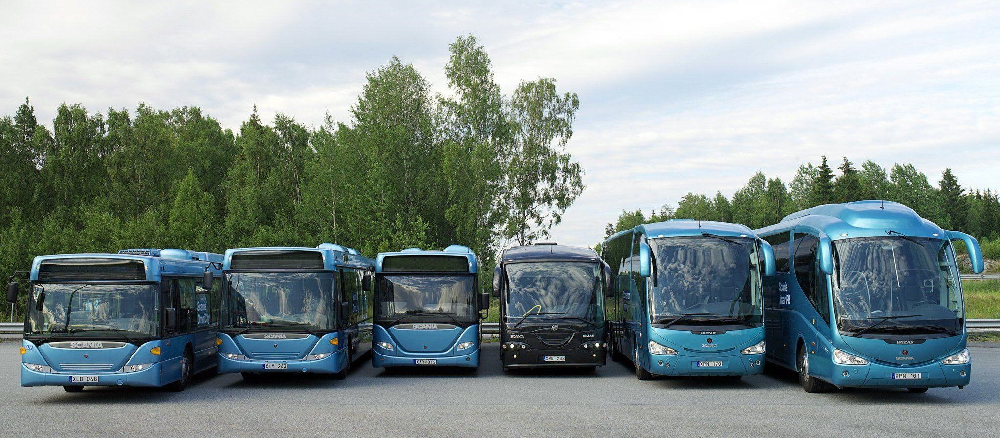

# master
# project10-Bus Station 
## Done by **Duaa Alsafasfeh**

***
## Introduction
Technologies Used:

1. HTML
1. bootstrap
1. CSS
1. JavaScript
1. UI/UX
1. Flex
1. Git
1. MySQL
1. PHP
1. Laravel

Create a Bus Reservation System.

## Project Overview

 Bus reservation system is a mobile or web software solution designed to provide customers with a personalized easy-to-utilize user experience for booking and purchasing tickets online.

# Database Tables:
1. [users] 
1. [cities] 
1. [buses] 
1. [drivers] 
1. [trips] 
1. [trip_bookings]
1. [payment]

## Important Links

1. Project Wireframe
   * [Wireframe Link](https://miro.com/app/board/uXjVO0pRjVU=/?share_link_id=471959284934)

1. Project Mockup
   * [Mockup Link](https://miro.com/app/board/uXjVO0oma0Y=/?share_link_id=601213347125)

1. Project Folder
   * [Repo Link](https://github.com/Dua-Alsafasfeh/master)

1. Trello Board
   * [Trello link](https://trello.com/invite/b/XXDsyGF0/3a8125c8222bf5391067a159b954ad90/master-piece)

1. Presentation
   * [Presentation link](https://www.canva.com/design/DAFKWEgcjVk/0eKglFh1XIz3ZqfAaV6GJw/view?utm_content=DAFKWEgcjVk&utm_campaign=designshare&utm_medium=link2&utm_source=sharebutton)

1. Report
   * [Report link](https://www.canva.com/design/DAFKqxEyNuA/L6-BAuw0mCGf-lq6ZE8MIg/view?utm_content=DAFKqxEyNuA&utm_campaign=designshare&utm_medium=link2&utm_source=sharebutton)

    